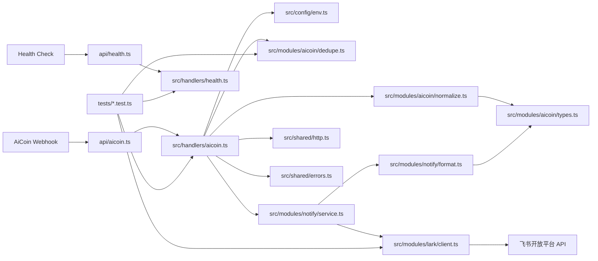
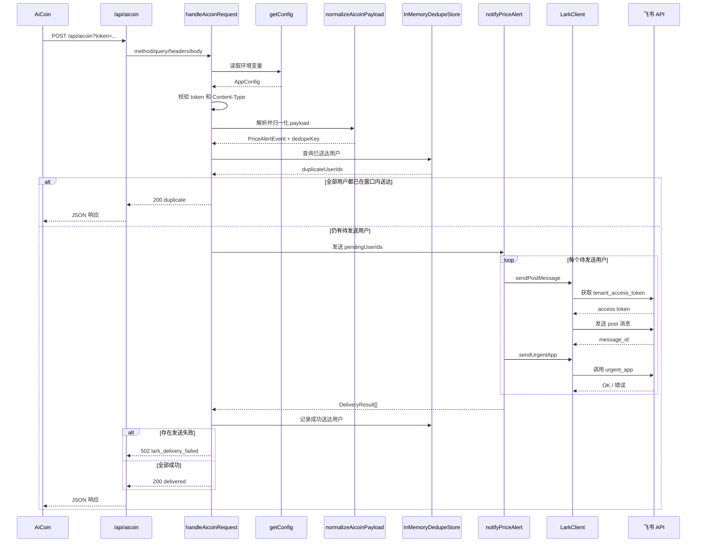

# AiCoin Lark Webhook

这是一个部署在 Vercel 上的轻量 TypeScript Webhook 服务，用来接收 AiCoin 价格预警，并把告警转发到飞书用户私聊，同时触发 `urgent_app` 加急提醒。

## 项目作用

- 使用单一路由接收 AiCoin Webhook。
- 在同一路由上支持 `GET` 和 `HEAD`，方便 AiCoin 做可达性检查。
- 对真实 `POST` 请求校验查询参数中的 token。
- 将 AiCoin 告警归一化后，逐个发送给配置中的飞书用户。
- 对成功送达的“事件 × 用户”组合做短时间窗口内存去重，避免重复提醒。

## 模块图



## 时序图



## 目录结构

```text
api/
  aicoin.ts        Vercel API 入口，负责适配请求和响应
  health.ts        健康检查入口
src/
  config/
    env.ts         环境变量解析与缓存
  handlers/
    aicoin.ts      主请求编排：鉴权、校验、去重、通知、错误映射
    health.ts      健康检查处理
  modules/
    aicoin/
      dedupe.ts    事件 × 用户级别的内存去重
      normalize.ts AiCoin payload 校验与归一化
      types.ts     AiCoin 事件类型定义
    lark/
      client.ts    飞书 API 客户端
    notify/
      format.ts    飞书消息内容格式化
      service.ts   通知发送编排
  shared/
    errors.ts      统一错误类型
    http.ts        统一响应结构
tests/
  *.test.ts        Vitest 单元测试
```

## 路由说明

- `GET /api/aicoin`：返回服务状态，供 AiCoin 做可达性检查。
- `HEAD /api/aicoin`：返回 `200` 且无响应体。
- `POST /api/aicoin?token=...`：校验 token 后处理 AiCoin 价格预警并推送飞书。
- `GET /api/health`：简单健康检查接口。

## 核心处理流程

1. Vercel 入口把请求对象交给 `handleAicoinRequest`。
2. handler 根据方法区分 `GET`、`HEAD` 和 `POST`。
3. `POST` 请求会依次进行 token 校验、Content-Type 校验和 JSON 解析。
4. `normalizeAicoinPayload` 校验 AiCoin 负载，并生成标准化事件与 `dedupeKey`。
5. `dedupe.ts` 按“事件 × 用户”检查在去重窗口内已经送达过哪些用户。
6. `notifyPriceAlert` 只对仍待发送的用户逐个调用飞书发送消息和 `urgent_app`。
7. handler 记录本次成功送达的用户，并根据结果返回 `delivered`、`duplicate` 或 `lark_delivery_failed`。

## 关键模块职责

- `src/handlers/aicoin.ts`：整个业务请求的控制中心。
- `src/modules/aicoin/normalize.ts`：把原始 AiCoin payload 严格转换成内部事件模型。
- `src/modules/aicoin/dedupe.ts`：维护进程内去重状态，只在单实例内生效。
- `src/modules/notify/service.ts`：串行发送消息，收集逐用户结果。
- `src/modules/notify/format.ts`：生成飞书 `post` 消息内容。
- `src/modules/lark/client.ts`：封装飞书鉴权、发送消息和 `urgent_app` 调用。

## 环境变量

本地开发前，先把 `.env.example` 复制为 `.env`。

必填项：

- `AICOIN_WEBHOOK_TOKEN`：AiCoin 调用时附带在 URL 上的 token。
- `LARK_APP_ID`：飞书自建应用 App ID。
- `LARK_APP_SECRET`：飞书自建应用 App Secret。
- `LARK_USER_ID_TYPE`：目标用户 ID 类型，可选 `open_id`、`union_id`、`user_id`。
- `LARK_URGENT_USER_IDS`：需要接收私聊和加急提醒的用户 ID，逗号分隔。

可选项：

- `LARK_BASE_URL`：飞书 API 地址覆盖值，默认是 `https://open.larksuite.com`。
- `REQUEST_TIMEOUT_MS`：下游请求超时，默认 `10000`。
- `LOG_LEVEL`：预留日志级别，默认 `info`。
- `DEDUP_WINDOW_MS`：内存去重窗口，单位毫秒，默认 `0`。

说明：

- 当 `DEDUP_WINDOW_MS > 0` 时，项目会把成功送达的“事件 × 用户”组合保存在进程内存中。
- 这份状态不会持久化，也不会跨实例共享。
- 服务重启、重新部署、Serverless 冷启动后，去重状态都会丢失。

## 本地开发

```bash
npm install
npm run dev
```

AiCoin 回调地址示例：

```text
https://your-domain.vercel.app/api/aicoin?token=replace-with-a-long-random-token
```

## 验证命令

```bash
npm run typecheck
npm test
```

`npm run build` 使用的是 `vercel build`。如果当前目录还没有关联到 Vercel 项目，CLI 可能会先提示执行 `vercel pull`。

## 维护提示

- 当前去重是进程内内存实现，适合减少短时间重复提醒，不适合做强一致幂等。
- `notifyPriceAlert` 目前按用户串行发送，目标用户变多时，整体延迟会线性增长。
- 只要有任意一个用户发送失败，handler 就会整体返回 `502`。
- 飞书 `tenant_access_token` 在单个 `LarkClient` 实例内有缓存，但不会跨请求复用。

## 示例请求

```bash
curl -X POST "http://localhost:3000/api/aicoin?token=replace-with-a-long-random-token" \
  -H "Content-Type: application/json" \
  -d '{
    "source": "AiCoin",
    "eventType": "price_alert",
    "exchange": "Binance",
    "symbol": "BTC/USDT",
    "triggerCondition": {
      "type": "Up to",
      "threshold": "90000"
    },
    "currentPrice": "91000",
    "remark": "Breakout watch",
    "timestamp": "2025-07-04T17:16:31Z"
  }'
```

## 示例 Payload

```json
{
  "source": "AiCoin",
  "eventType": "price_alert",
  "exchange": "Binance",
  "symbol": "BTC/USDT",
  "triggerCondition": {
    "type": "Up to",
    "threshold": "90000"
  },
  "currentPrice": "91000",
  "remark": "Breakout watch",
  "timestamp": "2025-07-04T17:16:31Z"
}
```
