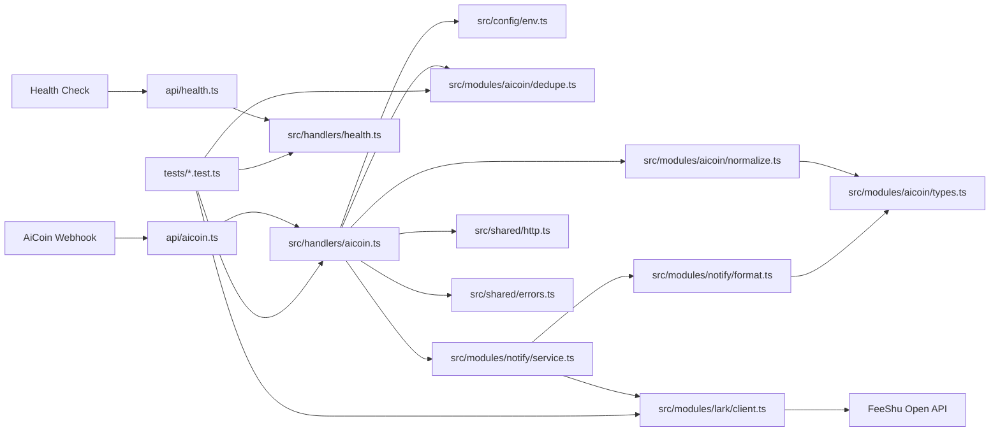
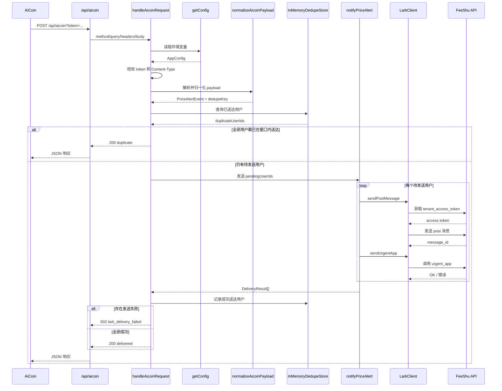

# 架构说明

## 模块图

服务以 `api/aicoin.ts`（Vercel 入口）接收 AiCoin 推送，通过 `src/handlers/aicoin.ts` 协调鉴权、归一化、去重和通知链路，最终通过飞书 API 推送给用户。

## 时序图

## 路由

| 方法 | 路径 | 说明 |
|---|---|---|
| GET | /api/aicoin | 健康检查，AiCoin 可达性验证 |
| HEAD | /api/aicoin | 仅返回 200，无响应体 |
| POST | /api/aicoin?token=... | 接收价格预警并推送飞书 |
| GET | /api/health | 简单健康检查 |

## 处理流程

1. Vercel 入口将请求适配为通用格式，交给 `handleAicoinRequest`。
2. handler 根据方法区分 GET/HEAD 和 POST。
3. POST 请求依次校验 token、Content-Type，解析 JSON。
4. `normalizeAicoinPayload` 校验 AiCoin 负载，生成标准化事件与 `dedupeKey`。
5. `dedupe.ts` 按「事件 x 用户」检查去重窗口内已送达的用户。
6. `notifyPriceAlert` 只对待发送用户逐个发送飞书消息并触发加急。
7. handler 记录成功送达的用户，根据结果返回 `delivered` / `duplicate` / `lark_delivery_failed`。

## 模块职责

| 模块 | 文件 | 职责 |
|---|---|---|
| 请求编排 | `src/handlers/aicoin.ts` | 鉴权、校验、去重、通知、错误映射 |
| 健康检查 | `src/handlers/health.ts` | GET 返回服务状态 |
| 配置 | `src/config/env.ts` | 环境变量解析与缓存 |
| 事件定义 | `src/modules/aicoin/types.ts` | AiCoin 事件类型定义 |
| 归一化 | `src/modules/aicoin/normalize.ts` | payload 校验与内部模型转换 |
| 去重 | `src/modules/aicoin/dedupe.ts` | 事件 x 用户级别的内存去重 |
| 通知 API | `src/modules/notify/format.ts` | 飞书 post 消息格式化 |
| 通知编排 | `src/modules/notify/service.ts` | 串行发送消息，收集结果 |
| 飞书客户端 | `src/modules/lark/client.ts` | 鉴权、发消息、urgent_app |
| HTTP | `src/shared/http.ts` | 请求/响应模型与响应构建 |
| 错误 | `src/shared/errors.ts` | HttpError / LarkAPIError |
